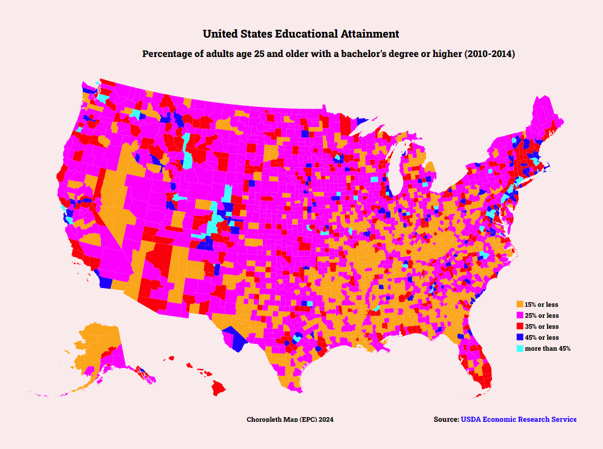

# Choropleth map [06 Feb 2024]

## Table of contents

- [Overview](#overview)
- [Screenshot](#screenshot)
- [Links](#links)
- [Built with](#built-with)
- [What I learned](#what-i-learned)
- [Useful resources](#useful-resources)
- [Author](#author)
- [Acknowledgments](#acknowledgments)

## Overview

**Objective:** Build an app that is functionally similar to this: https://choropleth-map.freecodecamp.rocks.

Fulfill the below user stories and get all of the tests to pass. 

**User Story #1:** My choropleth should have a title with a corresponding id="title".  
**User Story #2:** My choropleth should have a description element with a corresponding id="description".  
**User Story #3:** My choropleth should have counties with a corresponding class="county" that represent the data.  
**User Story #4:** There should be at least 4 different fill colors used for the counties.  
**User Story #5:** My counties should each have data-fips and data-education properties containing their corresponding fips and education values.  
**User Story #6:** My choropleth should have a county for each provided data point.  
**User Story #7:** The counties should have data-fips and data-education values that match the sample data.  
**User Story #8:** My choropleth should have a legend with a corresponding id="legend".  
**User Story #9:** There should be at least 4 different fill colors used for the legend.  
**User Story #10:** I can mouse over an area and see a tooltip with a corresponding id="tooltip" which displays more information about the area.  
**User Story #11:** My tooltip should have a data-education property that corresponds to the data-education of the active area.  

Here are the datasets you will need to complete this project:

- US Education Data:https://cdn.freecodecamp.org/testable-projects-fcc/data/choropleth_map/for_user_education.json
- US County Data:https://cdn.freecodecamp.org/testable-projects-fcc/data/choropleth_map/counties.json

### Screenshot

### Links

[Codepen](https://codepen.io/ecrujido/pen/)

### Built with

- HTML
- CSS
- Vanilla JavaScript
- D3.js
- topojson

### What I learned

How to create Choroplet map in D3.js, how to use scales, text, and assign various attributes.

### Useful resources

- [Free Code Camp](https://www.freecodecamp.org/learn)

## Author

- Codepen - [ecrujido](https://codepen.io/ecrujido/)

## Acknowledgments

Thank you, Free Code Camp for creating this course and making it free and accessible to everyone.

