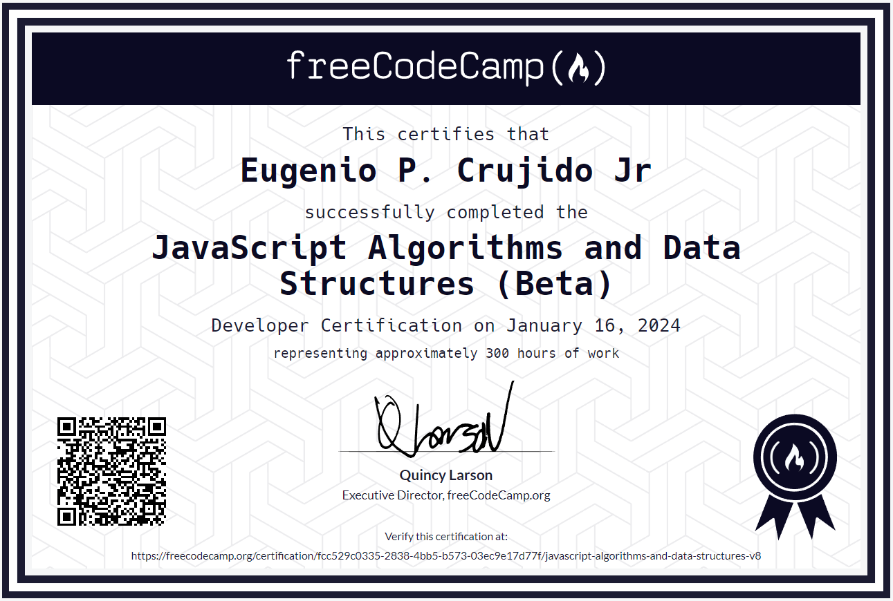

# JavaScript Algorithms and Data Structures Course

Verify this certification at https://www.freecodecamp.org/certification/ecrujido/javascript-algorithms-and-data-structures-v8

## Table of contents

- [Overview](#overview)
- [Links](#links)
- [Built with](#built-with)
- [What I learned](#what-i-learned)
- [Author](#author)
- [Acknowledgments](#acknowledgments)

## Overview

All project that I've completed and that are part of the FreeCodeCamp's JavaScript Algorithms and Data Structures course can be found here.

### Links

1. [Palindrome Checker](https://github.com/ecrujido/Free_Code_Camp/tree/0eb1b6f33b88fe184b4af01897ee800411925a47/JAVASCRIPT_ALGORITHMS_%26_DATA_STRUCTURES/EPC_Palindrome_Checker)  
2. [Roman Numeral Converter](https://github.com/ecrujido/Free_Code_Camp/tree/656774f5e65d31e5fa176e174ef89c0da5e8b916/JAVASCRIPT_ALGORITHMS_%26_DATA_STRUCTURES/EPC_Roman_Numeral_Converter)  
3. [Telephone Number Validator](https://github.com/ecrujido/Free_Code_Camp/tree/656774f5e65d31e5fa176e174ef89c0da5e8b916/JAVASCRIPT_ALGORITHMS_%26_DATA_STRUCTURES/EPC_Telephone_Number_Validator)  
4. [Cash Register](https://github.com/ecrujido/Free_Code_Camp/tree/0eb1b6f33b88fe184b4af01897ee800411925a47/JAVASCRIPT_ALGORITHMS_%26_DATA_STRUCTURES/EPC_Cash_Register)  
5. [Pokémon Search App](https://github.com/ecrujido/Free_Code_Camp/tree/617ebb235ead227de4c88b63c6443ec657ade2ac/JAVASCRIPT_ALGORITHMS_%26_DATA_STRUCTURES/EPC_Pokemon_Search_App)  

### Built with

- HTML5
- CSS
- D3.js
- Vanilla JavaScript
- Google Fonts
- API

### What I learned

Free Code Camp gave 5 challenging project to test my understanding on JavaScript and its Data Structure.

## Author

- Codepen.io - [@ecrujido](https://codepen.io/ecrujido)

## Acknowledgments

Thank you Free Code Camp for delivering all those great lessons and projects!
